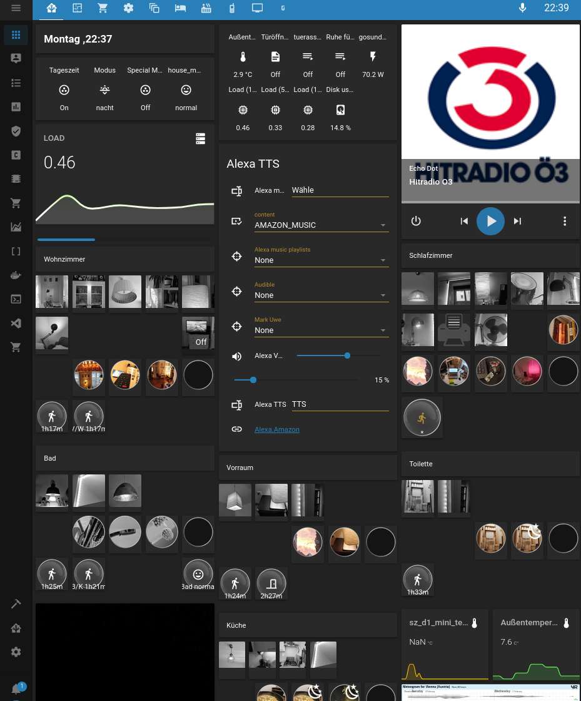

# Home Assistant 

[![Discord][discord-shield]][discord]
[![Community Forum][forum-shield]][forum]

## About

Its getting time to share my Home Assistant configuration. When you ask my wife, I gone a little crazy over the last year.

I run Hass.io on a around 4 year old i5 desktop pc wich is actually prittey beefy. The plan is to get a  [Openstack](https://docs.openstack.org/) running, but well... it bites back :P 

Used most of the time [packages](https://www.home-assistant.io/docs/configuration/packages/) but to clean up stuff I took [Frenck's](https://github.com/frenck) approach to go over every automation and package. 

be sure to hit the GitHub :star2: 

[aarch64-shield]: https://img.shields.io/badge/aarch64-yes-green.svg
[amd64-shield]: https://img.shields.io/badge/amd64-yes-green.svg
[armhf-shield]: https://img.shields.io/badge/armhf-no-red.svg
[armv7-shield]: https://img.shields.io/badge/armv7-no-red.svg
[commits-shield]: https://img.shields.io/github/commit-activity/y/Underknowledge/home-assistant-configuration?style=plastic

[commits]: https://github.com/Underknowledge/home-assistant-configuration/commits/master
[contributors]: https://github.com/hassio-addons/addon-vscode/graphs/contributors
[discord-ha]: https://discord.gg/c5DvZ4e
[discord-shield]: https://img.shields.io/discord/478094546522079232.svg
[discord]: https://discord.me/hassioaddons
[forum-shield]: https://img.shields.io/badge/community-forum-brightgreen.svg
[forum]: https://community.home-assistant.io/t/home-assistant-community-add-on-visual-studio-code/107863?u=frenck
[frenck]: https://github.com/frenck
[github-sponsors-shield]: https://frenck.dev/wp-content/uploads/2019/12/github_sponsor.png
[github-sponsors]: https://github.com/sponsors/frenck
[gitlabci-shield]: https://gitlab.com/hassio-addons/addon-vscode/badges/master/pipeline.svg
[gitlabci]: https://gitlab.com/hassio-addons/addon-vscode/pipelines
[home-assistant]: https://home-assistant.io
[i386-shield]: https://img.shields.io/badge/i386-no-red.svg
[issue]: https://github.com/hassio-addons/addon-vscode/issues
[keepchangelog]: http://keepachangelog.com/en/1.0.0/
[license-shield]: https://img.shields.io/github/license/hassio-addons/addon-vscode.svg
[maintenance-shield]: https://img.shields.io/maintenance/yes/2020.svg
[patreon-shield]: https://frenck.dev/wp-content/uploads/2019/12/patreon.png
[patreon]: https://www.patreon.com/frenck
[project-stage-shield]: https://img.shields.io/badge/project%20stage-production%20ready-brightgreen.svg
[reddit]: https://reddit.com/r/homeassistant
[releases-shield]: https://img.shields.io/github/release/hassio-addons/addon-vscode.svg
[releases]: https://github.com/hassio-addons/addon-vscode/releases
[repository]: https://github.com/hassio-addons/repository
[semver]: http://semver.org/spec/v2.0.0
[ubuntu-packages]: https://packages.ubuntu.com
